This is best viewed with a markdown renderer to view embedded images: https://atom.io/packages/markdown-preview

# Overview
Usage: python3 pa1.py -\<action> \<path to image> \[\<size of filter. An odd number>] \[\<sigma for Gauss>]

Example: python3 pa1.py -m ../inputImages/image1.png  5

Apply image processing algorithms to apply filters, generate histograms, or apply Canny edge detection.

Potential mandatory action arguments:

        -b       apply box filter. Size input needed.
        -c       apply Canny edge detection. Take high and low inputs
        -e       apply max entropy threshold.
        -ga      apply Gaussian filter. Size input needed. Sigma input needed
        -ga2     apply Gaussian filter using slower 2d method. Size input needed. Sigma input needed
        -gr      get gradient. Defaults to centralized method
        -grb     get gradient using backward method
        -grf     get gradient using forward method 
        -h       generate a histogram of the image's intensity and frequency.
        -help    print help.
        -m       apply median filter. Size input needed.
        -s       apply 3x3 Sobel filter.

# Box Filtering

This filter take in a size from the command line. The filter replaces each pixel with the  average of the pixels around it 
based on the given size

### originals    
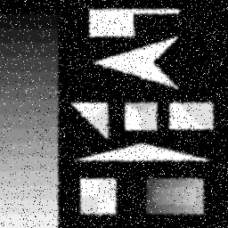 
### 3x3
 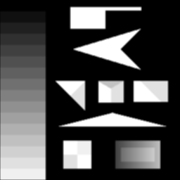
### 5x5
 

# Median Filtering
## originals    
 
 
### 3x3
 
### 5x5
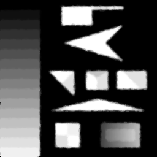 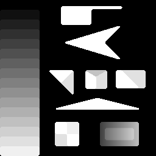
### 7x7
 

# Gaussian Filtering

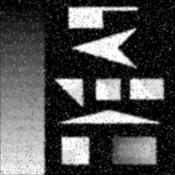

# Gradient Operations
### Original

### Central
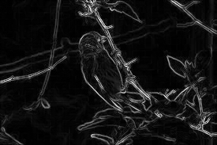
### Backward
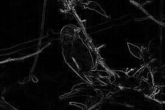
### Forward
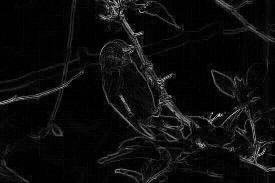

# Sobel Filtering
### originals    
 
### X
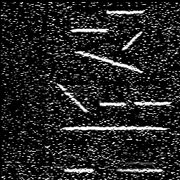
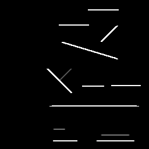
### Y
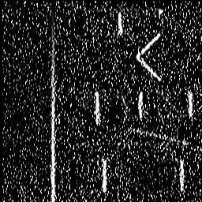
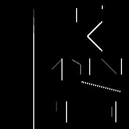

# Fast Gaussian Filtering
Fast Gaussian Filtering in implemeinted in function gaussianFilter1D and is about 4 time faster than the 2d method.

using image3-1.png:

2d: 21.4 sec

1d: 5.3 sec

# Histogram
it in here. use -h

# Can we use Entropy for thresholding?
yup. use -e

# Canny Edge Detection
### originals

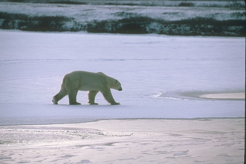
### my output using higher= 40 and lower= 25
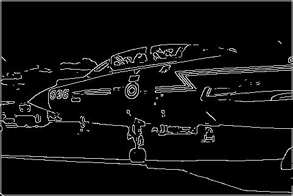
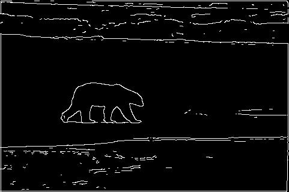

### given output
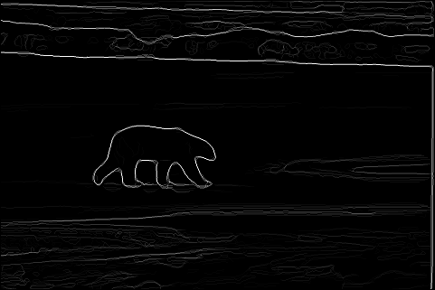
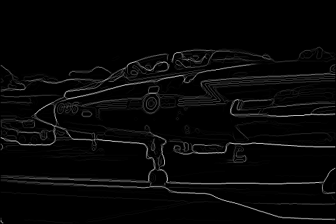